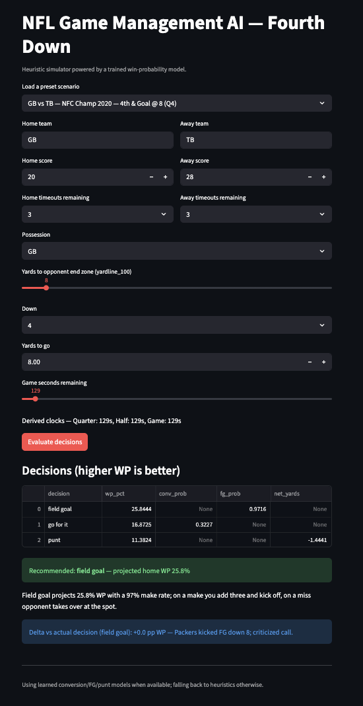

# NFL Game Management AI

Tooling for NFL in-game decision support: download play-by-play, engineer features, train a win-probability model, simulate fourth-down choices, and explain recommendations via LLM and Streamlit UI.



## Current State
- Streamlit UI + FastAPI API + LangGraph agent wired to WP and rate models.
- Feature-rich WP model (context/timeouts/goal-to-go/log distance) with calibration.
- Data-driven rates for conversion/FG/punt; sims show WP deltas vs actual decisions.
- Tests, eval scripts, deploy blueprint (Render).

## Project Layout
- `src/data/` — play-by-play downloaders.
- `src/features/` — feature engineering and dataset assembly.
- `src/models/` — training scripts (win probability).
- `src/sim/` — decision simulations (e.g., fourth down).
- `src/llm/` — natural-language explanations.
- `app/` — Streamlit front end.
- `outputs/`, `models/`, `data/` — generated artifacts (ignored).

## Getting Started
Quickstart:
```bash
python -m venv .venv
source .venv/bin/activate
pip install -r requirements.txt
python -m src.data.pbp_download 2021 2022 2023
python -m src.features.build_dataset
python -m src.sim.train_rates
python -m src.models.train_wp --model-type xgboost --calibrate
python -m src.models.eval_wp
python -m src.sim.eval_rates
streamlit run app/streamlit_app.py          # UI
uvicorn app.api:app --reload                # API
python -m src.agents.run_langgraph_agent ...# agent
```
1) Python 3.11+ recommended. Create env:
   ```bash
   python -m venv .venv
   source .venv/bin/activate
   ```
2) Install deps (once `requirements.txt` is populated):
   ```bash
   pip install -r requirements.txt
   ```
3) Set environment variables in `.env` (copy from `.env.example` when added).

## Basic Workflow
- Download play-by-play parquet (cached per season):
  ```bash
  python -m src.data.pbp_download 2021 2022 2023
  ```
- Build processed train/val datasets:
  ```bash
  python -m src.features.build_dataset
  ```
- Train win-probability model and save to `models/wp_model.joblib`:
  ```bash
  python -m src.models.train_wp            # add --calibrate to apply isotonic calibration
  # for stronger base model with calibration:
  python -m src.models.train_wp --model-type xgboost --calibrate
  ```
- Evaluate calibration/metrics (writes to `outputs/metrics/`):
  ```bash
  python -m src.models.eval_wp
  ```
- Train rate models for conversion/FG/punt (optional, improves sim fidelity):
  ```bash
  python -m src.sim.train_rates
  ```
- Evaluate rate models (AUC/Brier for go/FG; MAE for punt):
  ```bash
  python -m src.sim.eval_rates
  ```
- Run the Streamlit UI:
  ```bash
  streamlit run app/streamlit_app.py
  ```
- Demo scenarios in the console:
  ```bash
  python -m src.sim.demo_scenarios
  ```
- Scenario alignment report (compare model recs to tagged decisions):
  ```bash
  python -m src.sim.scenario_report
  ```
- LangGraph agent runner (returns recommendation + rationale):
  ```bash
  python -m src.agents.run_langgraph_agent --home KC --away BUF --posteam KC --yardline 50 --down 4 --ydstogo 1 --home-score 14 --away-score 10 --game-seconds 600
  ```
- REST API demo (FastAPI):
  ```bash
  uvicorn app.api:app --reload
  ```
  Then POST to `/recommend` with JSON body, e.g.:
  ```json
  {"home_team":"KC","away_team":"BUF","posteam":"KC","yardline_100":50,"down":4,"ydstogo":1,"home_score":14,"away_score":10,"game_seconds_remaining":600,"home_timeouts":3,"away_timeouts":3}
  ```
- CLI JSON recommender:
  ```bash
  python -m src.agents.cli_recommend --home KC --away BUF --posteam KC --yardline 50 --down 4 --ydstogo 1 --home-score 14 --away-score 10 --game-seconds 600
  ```
- Deploy to Render (Streamlit + API): see `render.yaml` and `docs/deploy_render.md`.
- Model Card: `reports/model_card.md`
- Case Study: `reports/case_study.md`

## Testing
```bash
pytest
```

## Notes
- Conversion/FG/punt probabilities are heuristic placeholders; swap with learned models (see `src/sim/rates.py`).
- If `models/rates/*.joblib` exist, the simulator uses them; otherwise it falls back to heuristics.
- Use `--calibrate` when training the WP model to improve probability calibration.
- Plots: see `outputs/metrics/wp_calibration.png`, `wp_roc.png`, and rate-model plots (`conversion_calibration.png`, `fg_calibration.png`, `*_error_hist.png`).

## Highlights (what’s interesting)
- LangGraph agent + CLI/API/UI surfaces a consistent decision engine.
- WP model uses richer situational features + calibration; data-driven rate models for go/FG/punt.
- Preset real-game scenarios show WP delta vs actual decisions (portfolio-friendly).
- Metrics and plots baked in; deploy blueprint for a live demo (Render).
- Case study + model card in `reports/` for recruiter-ready storytelling.

## Next Steps (TODO)
- Expand feature engineering (drives, score states, clock buckets) and refine target definition.
- Tune/benchmark alternative models (e.g., XGBoost/LightGBM) and calibration.
- Replace heuristic conversion/FG/punt probabilities with learned models.
- Add tests (pytest) for feature calc, model inference, sim decisions, and Streamlit handlers.
